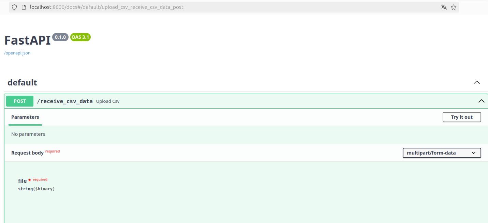
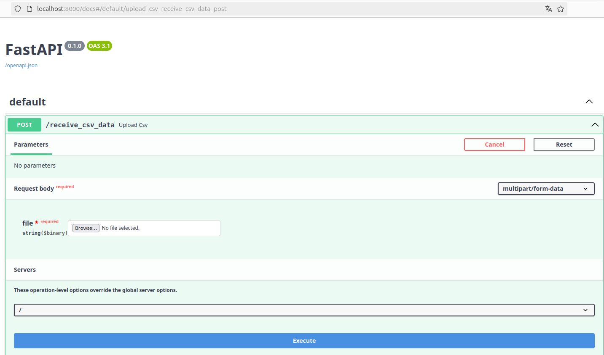
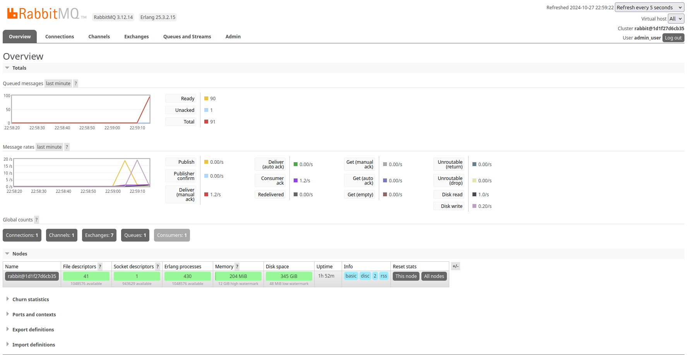
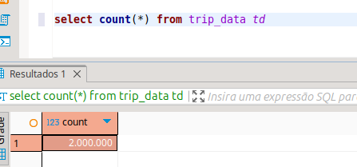
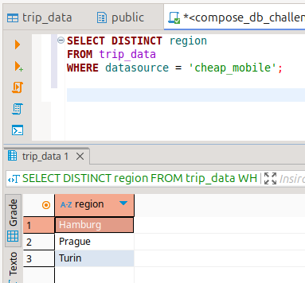
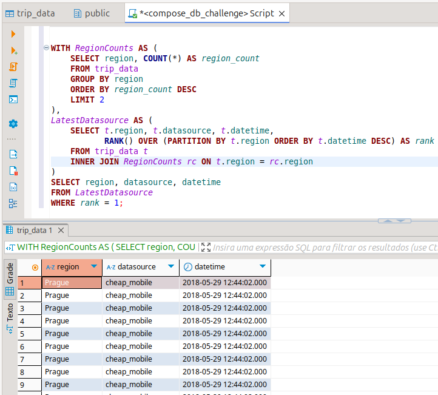
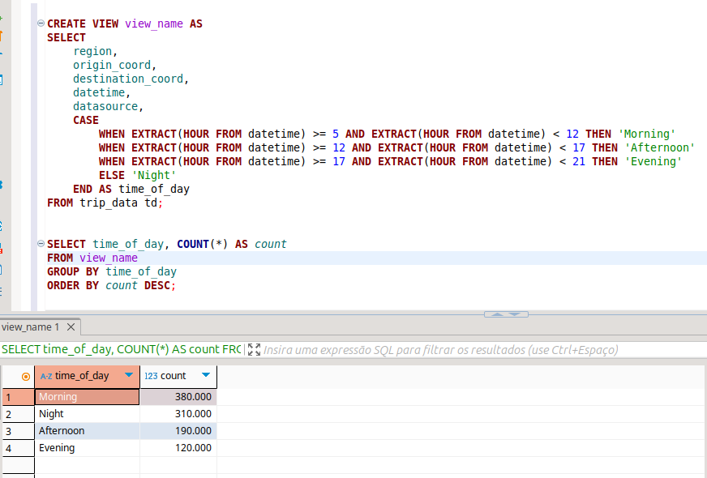

# data_pipeline_service
An aplication that provides an API to ingest data on a on-demand basis.

## Requirements for this project.

    Docker

## Setting the environment

The best way to run this project it's through Docker, in which you can set everything up using the docker-compose command bellow:

First of all you need to clone the project:

    git clone https://github.com/Diegorpp/data_pipeline_service.git

After that you need to configure a environment file called '.env' on the same directory where the 'docker-compose.yaml' is, which is the root of the project. the content on the '.env' file should looks like this:

    POSTGRES_USER=''
    POSTGRES_PASSWORD=''
    RABBITMQ_HOST=''
    RABBITMQ_QUEUE=''
    RABBITMQ_USER=''
    RABBITMQ_PASS=''
    RABBITMQ_PORT=''

After that you just need to run the docker compose to build everything.

    docker compose up -d --build

This will deploy 4 microsservices:

- **consumer**: Receive a batch of line from a CSV with the follwoing column pattern. [region,origin_coord,destination_coord,datetime,datasource]
- **data_pipeline_api**: API for data ingestion, breaks the CSV in batches and send it to the rabbitmq broker.
- **postgres**: Store the data of the application.
- **rabbitmq**: Message broker to manage the throughput of data and allow multiple consumer to consume the data. This version has an interface to manage and see the behavior of the application.

Then you must access the local url to see the API interface.

    localhost:8000

The interface should looks like this:



To manually test it you can click on the endpoint, then on the "Try it out" button. After that um upload the '.csv' file and then click on "Execute". You can see how it should looks like bellow:




The CSV file should contain the following columns with this structure:

    datasource: str
    region: str
    origin_coord: POINT (Lat, Lon)
    destination_coord: POINT (Lat, Lon)
    datetime: datetime

After you send the CSV file to the API you can watch the consume proccess through the rabbitmq interface in 'http://localhost:15672'. The login and password was define on the variables RABBITMQ_USER and RABBITMQ_PASS on the .env file. After the login you can see this interface:



To watch the insertions I usually use a tool called dbeaver, in which I can connect to the local database built by the docker compose. The image bellow shows the amount of data that I inserted on the database.

You can use the tool of your preference to see and execute SQL on the database.



## Queries for observations

All created queries are at ./src/sql

### What regions has the "cheap_mobile" datasource appeared in?

```SQL
SELECT DISTINCT region
FROM trip_data
WHERE datasource = 'cheap_mobile';
```



### From the two most commonly appearing regions, which is the latest datasource?


```SQL
WITH RegionCounts AS (
    SELECT region, COUNT(*) AS region_count
    FROM trip_data
    GROUP BY region
    ORDER BY region_count DESC
    LIMIT 2
),
LatestDatasource AS (
    SELECT t.region, t.datasource, t.datetime,
           RANK() OVER (PARTITION BY t.region ORDER BY t.datetime DESC) AS rank
    FROM trip_data t
    INNER JOIN RegionCounts rc ON t.region = rc.region
)
SELECT region, datasource, datetime
FROM LatestDatasource
WHERE rank = 1;
```



### Develop a way to obtain the weekly average number of trips for an area, defined by a bounding box (given by coordinates) or by a region.

 - I don't know how to do this one yet. Need to learn later.

 - And to test it I still need to configure the database to allow coordinates values or transforme the string value some how.


```SQL
    -- In construction
```

### Trips with similar origin, destination, and time of day should be grouped together

Obs: I should create a view with this group, but I don't have time to get the similarity betwen diferent origins and destinations

So I will create a view based on the similar day time

```SQL
CREATE VIEW view_name AS
SELECT 
    region,
    origin_coord,
    destination_coord,
    datetime,
    datasource,
    CASE 
        WHEN EXTRACT(HOUR FROM datetime) >= 5 AND EXTRACT(HOUR FROM datetime) < 12 THEN 'Morning'
        WHEN EXTRACT(HOUR FROM datetime) >= 12 AND EXTRACT(HOUR FROM datetime) < 17 THEN 'Afternoon'
        WHEN EXTRACT(HOUR FROM datetime) >= 17 AND EXTRACT(HOUR FROM datetime) < 21 THEN 'Evening'
        ELSE 'Night'
    END AS time_of_day
FROM your_table_name;


SELECT time_of_day, COUNT(*) AS count
FROM view_name
GROUP BY time_of_day
ORDER BY count DESC;
```



## Checklist of things that still need to be done.


[x] - Create the API.

[X] - Create the Postgres Database.

[X] - Integrate the datasbase.

[X] - Create the datamodel and ORM.

[X] - Ingest the simplest data possible.

[X] - Convert the application to be scalable (Tested with just a million on the API)

[X] - Create the queries needed for the challenge

[ ] - Convert the database to optimize coordinate data

[ ] - Create some feature to manage the status of the injestion.

[ ] - Create a video to explain the code.

[X] - Update the last version of the README.md file with all the steps needed to run the project.